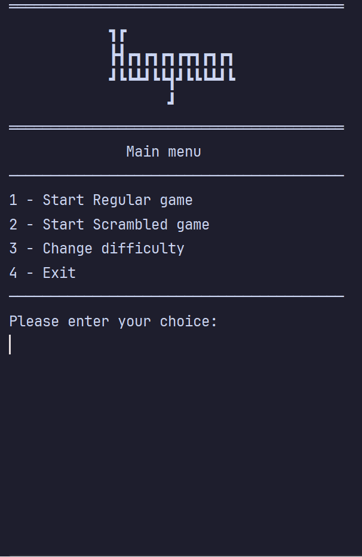

# Виселица



Консольная версия игры "Виселица", написанная на Java. Эта игра была разработана с целью изучения объектно-ориентированного программирования (ООП). В этой однопользовательской игре игрок должен угадать слово, вводя буквы по одной. За каждую неправильную попытку игрок теряет жизнь. Игра продолжается до тех пор, пока игрок не угадает слово или не потеряет все жизни.

## Особенности

- Случайный выбор слова из заранее определённого списка.
- Два режима игры:
    - **Обычный режим**: Угадайте слово в его оригинальной форме.
    - **Режим с перемешанными буквами**: Угадайте слово с перемешанными буквами (кроме первой буквы).
- Выбор уровня сложности.
- Удобный интерфейс для ввода букв.
- Отслеживание оставшихся попыток.

## Установка Linux

1. Клонируйте репозиторий:

   ```bash
   git clone https://github.com/GDPixel/HangmanGame
   ```

2. Перейдите в директорию проекта:

   ```bash
   cd HangmanGame/
   ```

3. Скомпилируйте проект:

   ```bash
   javac -d ./out @sources.txt
   ```
4. Скопируйте resources to ./out
    ```bash
    cp -r resources/ out/
    ```

5. Запустите игру:
    ```bash
    cd out/
    ```
   ```bash
   java hangman.Main
   ```

## Установка Windows

1. Клонируйте репозиторий:

   ```bash
   git clone https://github.com/GDPixel/HangmanGame
   ```

2. Перейдите в директорию проекта:

   ```bash
   cd HangmanGame
   ```

3. Скомпилируйте проект:

   ```bash
   javac -d .\out @sources.txt
   ```
4. Скопируйте resources to .\out

    ```bash
    mkdir -r .\out\resources
    ```
    ```bash
    copy .\resources .\out\resources
    ```

5. Запустите игру:
    ```bash
    cd out
    ```
   ```bash
   java hangman.Main
   ```

## Использование

1. Начните игру, следуя инструкциям в консоли.
2. Можете изменить сложность
3. Выберите режим игры: Обычный или С перемешанными буквами.
4. Вводите буквы, чтобы угадать слово.
5. Следите за количеством оставшихся попыток.
6. Удачи!

# Hangman

A console version of the "Hangman" game written in Java. This game was developed to learn Object-Oriented Programming (OOP). In this single-player game, the player must guess a word by entering letters one at a time. For each incorrect attempt, the player loses a life. The game continues until the player either guesses the word or loses all their lives.

## Features

- Random word selection from a predefined list.
- Two game modes:
    - **Regular Mode**: Guess the word in its original form.
    - **Scrambled Mode**: Guess the word with the letters scrambled (except for the first letter).
- Difficulty level selection.
- User-friendly interface for letter input.
- Tracking of remaining attempts.

## Installation Linux

1. Clone the repository:

   ```bash
   git clone https://github.com/GDPixel/HangmanGame
   ```

2. Navigate to the project directory:

   ```bash
   cd HangmanGame/
   ```

3. Compile the project:

   ```bash
   javac -d ./out @sources.txt
   ```

4. Copy resources to ./out:

   ```bash
   cp -r resources/ out/
   ```
   
5. Run the game:

   ```bash
   cd out/
   ```
   ```bash
   java hangman.Main
   ```
## Installation Windows

1. Clone the repository:

   ```bash
   git clone https://github.com/GDPixel/HangmanGame
   ```

2. Navigate to the project directory:

   ```bash
   cd HangmanGame
   ```

3. Compile the project:

   ```bash
   javac -d .\out @sources.txt
   ```

4. Copy resources to ./out:

    ```bash
    mkdir -r .\out\resources
    ```
    ```bash
    copy .\resources .\out\resources
    ```

5. Run the game:

   ```bash
   cd out
   ```
   ```bash
   java hangman.Main
   ```

## Usage

1. Start the game by following the instructions in the console.
2. You can change the difficulty.
3. Choose your game mode: Regular or Scrambled.
4. Enter letters to guess the word.
5. Keep an eye on the number of remaining attempts.
6. Good luck!